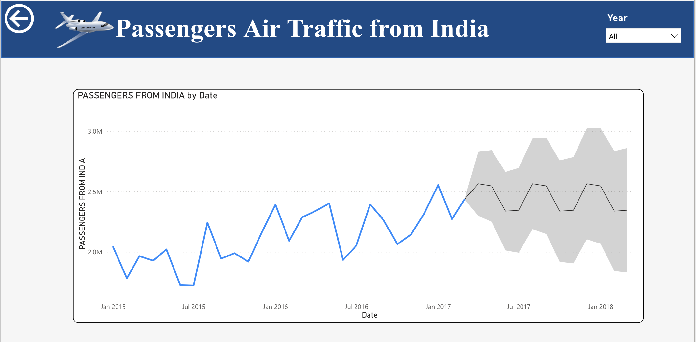

# ✈️ International Air Traffic Analysis – Power BI Dashboard  
*Interactive Data Visualization of Passenger and Freight Traffic (2015–2017)*


---

## 🧭 Project Overview

This Power BI project analyzes international air traffic to and from India from 2015 to 2017. It uses multiple datasets to uncover trends in passenger volume, freight movement, and airline performance across cities and countries.

---

## 🔍 Project Objectives

- Identify peak air traffic quarters and top-performing airlines  
- Analyze passenger and freight trends over time  
- Visualize city-to-city and country-to-country travel flows  
- Forecast future travel volumes  
- Identify key influencers behind traffic changes

---

## 📊 Key Visualizations

### 📈 1. Forecasting Passenger Trends  


### 💡 2. Key Influencers for Freight Drop  


### 🧩 3. Decomposition Tree  


### 🗺️ 4. Flow Map of Travel Routes  


### 🌍 5. Country-Wise Passenger Traffic  


### 📦 6. Country-Wise Freight Movement  


### 🏙️ 7. City-Level Air Traffic Overview  


### 🛫 8. Top 10 Airlines by Passenger Volume  


### 📅 9. Monthly Trends of Passenger & Freight  


---

## 🧰 Tools & Techniques Used

- **Power BI Desktop**
- **Power Query Editor (M Language)**
- **DAX (Data Analysis Expressions)**
- **Star Schema data modeling**
- **AI Visuals & Forecasting**
- **Interactive dashboard design** with slicers, bookmarks, and drilldowns

---

## 💡 DAX Usage Highlights

Also used to:
- Rank top airlines  
- Create filters by year, month, quarter  
- Define forecast series using time intelligence functions

Example DAX:
```DAX
Total Passengers = [Passengers From India] + [Passengers To India]
Freight Difference = [Freight From India] - [Freight To India]
---

### 💡 Additional DAX Applications

Also used to:
- Rank top airlines  
- Create filters by year/month/quarter  
- Define forecast series with time intelligence  

---

### 🔄 Power Query (M Language)

Used for data cleaning and transformation:
- Removed nulls, blanks, and duplicates  
- Merged `Year` and `Month` to form a `Date` column  
- Changed data types using M syntax like:
```m
Table.TransformColumnTypes(Source,{{"Passengers From India", Int64.Type}})
